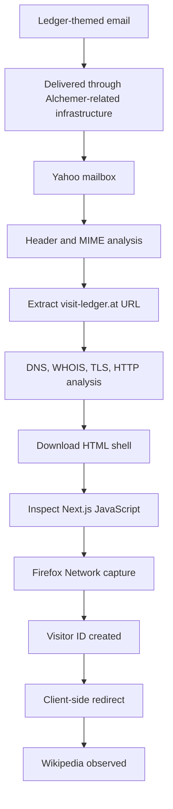

# Ledger-Themed Phishing Investigation: Alchemer Delivery, Dynamic Redirects, and Probable Cloaking

> A defensive case study in email authentication, Next.js Server Actions, visitor tracking, and client-side redirect analysis.

## Summary

This repository documents a defensive, low-impact investigation of a Ledger-themed
phishing campaign. Four visually similar emails impersonating Ledger were received in a
single 58-minute window. The messages were delivered through authenticated
Alchemer-related infrastructure and pointed to a lookalike domain, `visit-ledger.at`,
rather than a genuine Ledger domain. The destination operated as a Cloudflare-fronted
Next.js application that created a visitor identifier, invoked trust and "Cloakit"-named
Server Actions, and obtained its redirect destination dynamically. During the
investigation the browser was ultimately navigated to Wikipedia after JavaScript and
Server Action execution.

**No credentials were entered, no recovery phrase was submitted, no authentication was
bypassed, and no unauthorized access was attempted.** The investigation remained
defensive, educational, and low impact throughout.

## Status

Educational case study. Analysis complete for the single message reviewed in depth.
Several evidence gaps remain (see [Limitations](docs/limitations.md) and
[Known Evidence Gaps](#known-evidence-gaps)).

## Ethical scope

- Analysis of emails received by the author.
- Low-impact observation of publicly accessible web resources.
- No exploitation, authentication bypass, brute force, credential submission,
  recovery-phrase submission, wallet connection, panel access, origin-IP discovery,
  cloaking bypass, or unauthorized data access.

See [Scope and Ethics](docs/scope-and-ethics.md) and [DISCLAIMER.md](DISCLAIMER.md).

## Key findings

1. A Ledger-themed message used a non-Ledger destination domain (`visit-ledger.at`).
2. The message was delivered through authenticated Alchemer-related infrastructure.
3. SPF, DKIM, and DMARC **passed** — for the authenticated sending domain, **not** for Ledger.
4. The email contained Alchemer template remnants and internal identifiers.
5. The URL led to a Cloudflare-fronted Next.js application returning HTTP 200.
6. The application used a dynamic route parameter named `email`.
7. The application created a visitor ID via a Next.js Server Action.
8. The client code contained `checkCloakitAction` and `setCloakitTrustAction`
   (probable cloaking logic).
9. The final redirect URL was obtained dynamically from the server.
10. The browser ultimately navigated to Wikipedia; the redirect was **not** an initial
    HTTP 301/302.

No credential-harvesting or recovery-phrase form was directly observed.

## Investigation flow



## Technologies and tools

`whois` · `dig` · `host` · `openssl s_client` · `sslscan` · `curl` · `wafw00f` ·
Firefox Developer Tools (Network Monitor) · Cloudflare · Next.js · React Server
Components · Next.js Server Actions · HTTP/2 · HTTP/3 · TLS 1.3.

Technologies are contextual, not malicious indicators.

## Main IOC

| Type | Value |
|---|---|
| Domain | `visit-ledger.at` |
| URL | `https://visit-ledger.at/alchcemser` |
| Route | `/alchcemser` |

> **Warning — shared infrastructure.** The Cloudflare edge address `172.64.80.1`
> (and the IPv6 endpoint observed during TLS negotiation) is **shared Cloudflare
> infrastructure**, not an attacker-controlled origin server. **Do not block this IP by
> itself.** Prefer domain- and URL-based controls. See
> [False-Positive Notes](iocs/false-positive-notes.md).

## Repository map

```text
├── README.md                     This file
├── LICENSE                       MIT (documentation/code) — see file for content notes
├── SECURITY.md                   Responsible-use and reporting guidance
├── DISCLAIMER.md                 Publication disclaimer
├── mkdocs.yml                    GitHub Pages (MkDocs) configuration
├── docs/                         Full technical report (per-section Markdown)
├── evidence/                     Sanitized evidence excerpts + private-evidence notice
├── images/                       Sanitized investigation figures + sanitization guidance
├── diagrams/                     Mermaid diagrams
├── iocs/                         IOC inventory (csv/json/md) + false-positive notes
├── detection/                    Generic hunting guidance, example Splunk queries
├── publication/                  LinkedIn, Medium, portfolio, release notes
└── templates/                    Reusable case-study / evidence-log templates
```

## Public evidence warning

This repository is intended to contain **only sanitized** material. Raw evidence
(complete raw email, full recipient address, complete Message-ID, full visitor ID, raw
screenshots) is retained privately and excluded here. See
[evidence/PRIVATE_EVIDENCE_NOT_INCLUDED.md](evidence/PRIVATE_EVIDENCE_NOT_INCLUDED.md).

## Full documentation

Start at [docs/index.md](docs/index.md), or build the site with MkDocs (see
[publication notes](docs/publication-notes.md)).

## Lessons demonstrated

Phishing triage · email header and SMTP envelope analysis · SPF/DKIM/DMARC
interpretation · MIME/HTML inspection · IOC extraction · WHOIS/DNS/TLS/HTTP analysis ·
JavaScript and Next.js Server Action analysis · HTTP vs. JavaScript redirects · visitor
tracking and cloaking indicators · confidence-based reporting · responsible publication.

## Limitations

The original downstream phishing destination, if one existed, was **not** directly
observed. Several evidence gaps remain. See [Limitations](docs/limitations.md).

## Known evidence gaps

Complete raw headers for all four emails; exact per-email calendar dates/timezone;
Message-ID comparison; Alchemer `cid`/`sid`/`rid`/`qid` comparison across messages;
SHA-256 hashes of `ledger.html` and `app.js`; full HAR export; server-side redirect
decision criteria; original phishing destination (if different); operator identity;
Alchemer account status; whether any credential-harvesting page existed earlier. See
[Known Evidence Gaps](docs/limitations.md#known-evidence-gaps).

## Disclaimer

This case study documents the defensive analysis of emails received by the author and
low-impact observation of publicly accessible web resources. No authentication bypass,
exploitation, credential submission, recovery-phrase submission, or unauthorized access
was attempted. Sensitive recipient data, session information, and tracking identifiers
have been redacted. See [DISCLAIMER.md](DISCLAIMER.md).

## License

See [LICENSE](LICENSE). The domain, identifiers, and brand names appear only for
educational documentation of a real defensive investigation.
