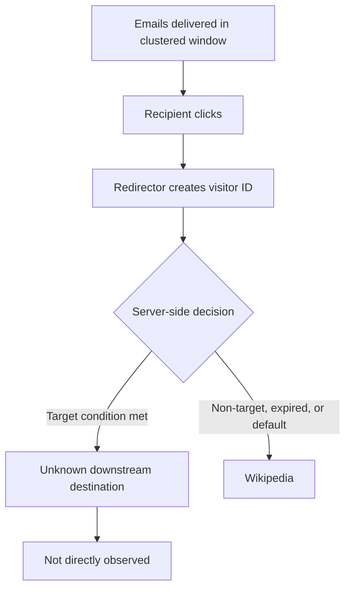

# Diagram — Campaign-Lifecycle Hypotheses

The unknown downstream destination was **not** directly observed. See the
[Threat Assessment](../docs/threat-assessment.md#campaign-lifecycle-hypotheses) for the
lettered hypotheses (A–E) and their confidence levels.
