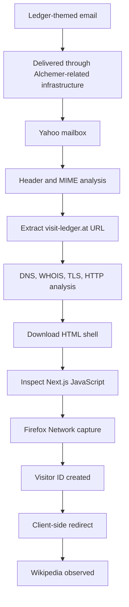

# Diagram — Email Delivery and Investigation Flow

```mermaid
flowchart TD
    A[Ledger-themed email] --> B[Delivered through Alchemer-related infrastructure]
    B --> C[Yahoo mailbox]
    C --> D[Header and MIME analysis]
    D --> E[Extract visit-ledger.at URL]
    E --> F[DNS, WHOIS, TLS, HTTP analysis]
    F --> G[Download HTML shell]
    G --> H[Inspect Next.js JavaScript]
    H --> I[Firefox Network capture]
    I --> J[Visitor ID created]
    J --> K[Client-side redirect]
    K --> L[Wikipedia observed]
```
