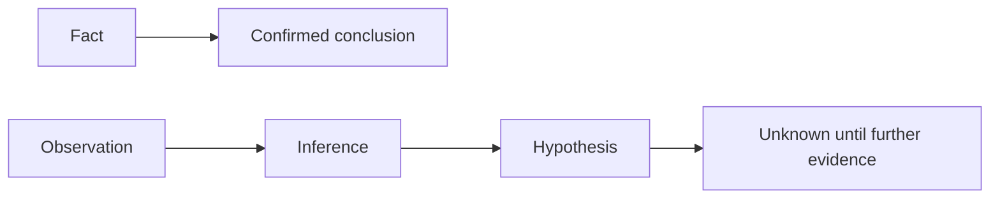

# Diagram — Evidence Classification

Every material claim in this report is tagged with an evidence label
(**FACT / OBSERVATION / INFERENCE / HYPOTHESIS / UNKNOWN**) and a confidence level
(**Confirmed / High / Moderate / Low / Unknown**). Inferences are never promoted to facts.
