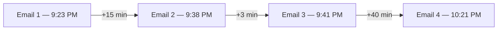
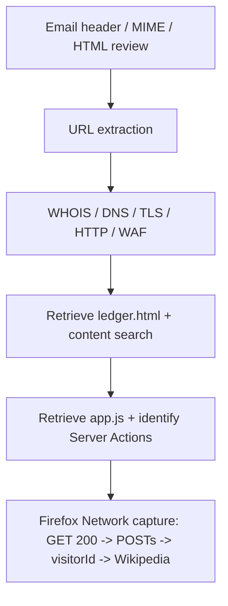

# Diagram — Investigation Timeline

## Email delivery (58-minute clustered window)

```mermaid
flowchart LR
    E1["Email 1 — 9:23 PM"] -->|+15 min| E2["Email 2 — 9:38 PM"]
    E2 -->|+3 min| E3["Email 3 — 9:41 PM"]
    E3 -->|+40 min| E4["Email 4 — 10:21 PM"]
```

## Investigation steps

```mermaid
flowchart TD
    T1[Email header / MIME / HTML review] --> T2[URL extraction]
    T2 --> T3[WHOIS / DNS / TLS / HTTP / WAF]
    T3 --> T4[Retrieve ledger.html + content search]
    T4 --> T5[Retrieve app.js + identify Server Actions]
    T5 --> T6[Firefox Network capture: GET 200 -> POSTs -> visitorId -> Wikipedia]
```

Exact per-email calendar dates and timezone require the raw headers (not included).
