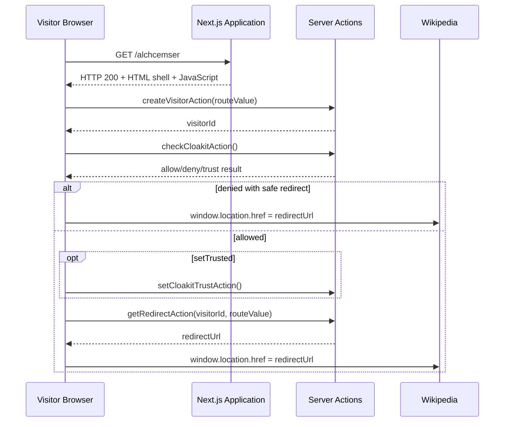

# Diagram — Application Execution Flow

The final redirect URL was obtained dynamically from the server. The observed destination
was Wikipedia; the original downstream destination, if any, was not observed.
