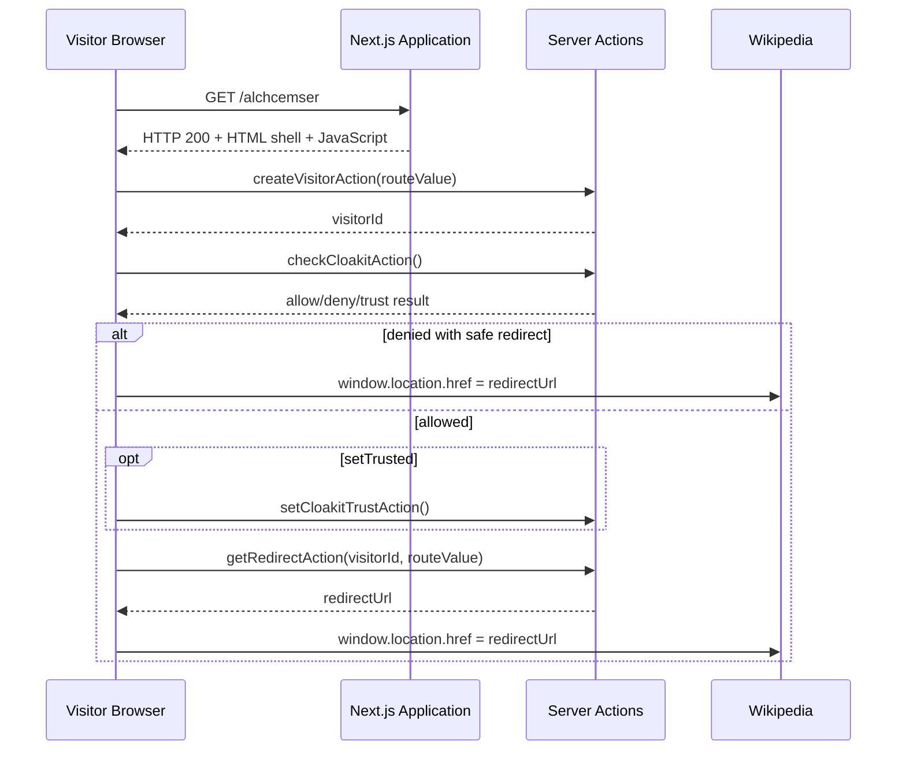

# Browser & Network Analysis

Controlled observation of the application's client-side behavior using Firefox Developer
Tools (Network Monitor).

---

## 1. Procedure

Firefox in a controlled Linux analysis environment was used. Developer Tools were opened
manually via **Menu → More tools → Web Developer Tools** (the F12 shortcut did not work
in that session; `Ctrl + Shift + I` was also available).

- The **Network** tab was selected.
- **Persist Logs** was enabled.
- The request list was cleared before navigation.
- The URL entered was `https://visit-ledger.at/alchcemser`.
- The browser ultimately displayed `https://www.wikipedia.org/`.

!!! note
    No claim is made that the analysis operating system was detected by anti-analysis
    logic. See [Methodology](methodology.md).

---

## 2. Captured request sequence

1. Initial **GET** to `https://visit-ledger.at/alchcemser`
2. Static assets from `visit-ledger.at/_next/static/...`
3. Multiple **POST** requests to `visit-ledger.at/alchcemser`
4. A request associated with `rum`
5. Final **GET** navigation to `https://www.wikipedia.org/`

The initial document request:

```text
Method: GET
Status: 200
Protocol: HTTP/3
Host: visit-ledger.at
Path: /alchcemser
```

Response headers were consistent with the earlier curl results:

```text
server: cloudflare
x-powered-by: Next.js
content-type: text/html; charset=utf-8
cache-control: private, no-cache, no-store, max-age=0, must-revalidate
```

**FACT:** The browser first received an HTTP 200 document from `visit-ledger.at`.

**FACT:** The browser later navigated to Wikipedia.

**FACT:** The first response was **not** an HTTP 301 or 302 redirect.

**INFERENCE — High confidence:** The navigation to Wikipedia was client-side and occurred
after JavaScript and Server Action execution.

---

## 3. Server Action response

The response body of the first relevant POST:

```text
0:{"a":"$@1","f":"","b":"SLPCX_WbhLb0KQizny4V5","q":"","i":false}
1:{"visitorId":"6a69f7d7…cb113"}
```

The response content type shown in Developer Tools was:

```text
text/x-component
```

**FACT:** The Server Action returned a visitor ID.

**FACT:** The response used a React/Next.js **component-stream** format
(`text/x-component`) rather than a simple standalone JSON response.

!!! danger "Redaction"
    The full visitor ID is redacted in all public material as `6a69f7d7…cb113`. The
    complete value is retained only in private evidence.

A second selected POST showed an empty Response panel in Developer Tools.

> No readable response body was preserved or displayed for that selected request.

This does not establish that the server returned no data; the protocol-level details were
not inspected for that request.

---

## 4. Application execution flow



---

## 5. Redirect result

Final observed destination:

```text
https://www.wikipedia.org/
```

**FACT:** Wikipedia was the browser's final visible destination during the test.

**FACT:** The domain and application remained operational enough to resolve in DNS,
negotiate TLS, serve HTML, serve JavaScript, execute Server Actions, create a visitor ID,
and perform client-side navigation.

!!! warning "Do not claim shutdown"
    > The redirector and visitor-tracking application remained operational during the
    > investigation, but the observed destination was benign.
