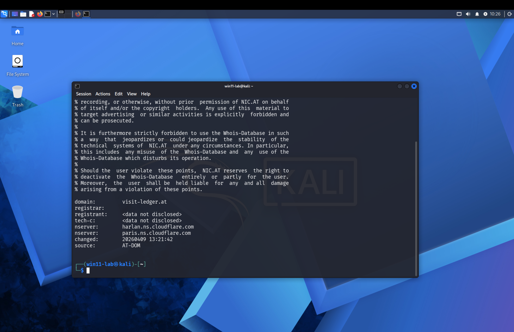
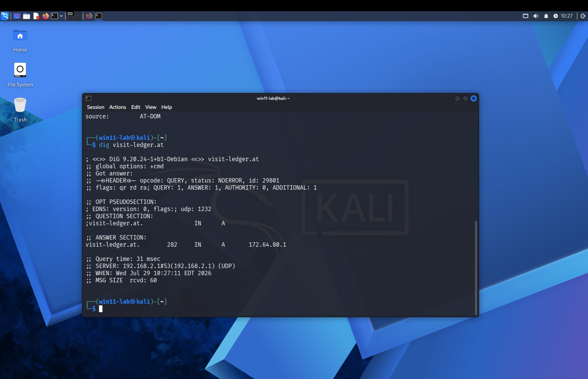
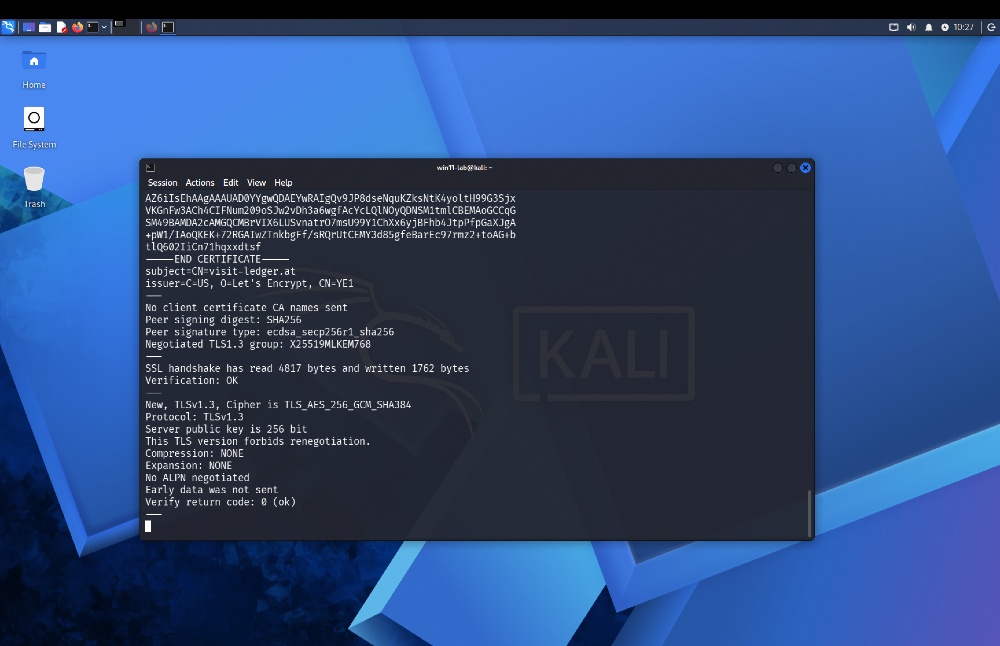
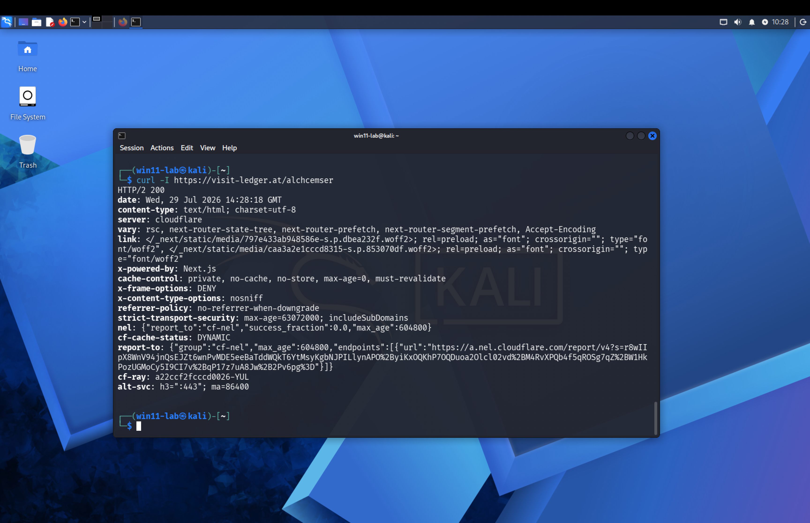

# Infrastructure Analysis

WHOIS, DNS, TLS, HTTP headers, and WAF characterization of `visit-ledger.at`. Exact
commands are in the [commands appendix](appendix-commands.md).

---

## 1. WHOIS

```bash
whois visit-ledger.at
```

Observed relevant output:

```text
domain:         visit-ledger.at
registrar:
registrant:     <data not disclosed>
tech-c:         <data not disclosed>
nserver:        harlan.ns.cloudflare.com
nserver:        paris.ns.cloudflare.com
changed:        20260409 13:21:42
source:         AT-DOM
```

<a id="figure-a"></a>


> **Figure A — WHOIS lookup.** The `whois` output on Kali, including the NIC.AT
> usage notice and the fields above.

**FACT:** Registrant and technical-contact details were not disclosed in the returned
record.

**FACT:** The returned name servers were Cloudflare name servers.

**FACT:** The registry record showed a `changed` timestamp of 2026-04-09 13:21:42.

!!! warning "Do not treat `changed` as the registration date"
    > The `.at` registry record showed a change timestamp of April 9, 2026. The supplied
    > WHOIS output did not establish the original creation date.

    The registrar field appeared blank in the command output; no registrar is inferred or
    invented.

---

## 2. DNS

```bash
dig visit-ledger.at
dig +short visit-ledger.at
dig MX visit-ledger.at
dig NS visit-ledger.at
dig TXT visit-ledger.at
host 172.64.80.1
```

### 2.1 A record

```text
visit-ledger.at. 282 IN A 172.64.80.1
```

```text
172.64.80.1
```

<a id="figure-b"></a>


> **Figure B — DNS A-record lookup.** `dig visit-ledger.at`
> (DiG 9.20.24-1+b1-Debian). Answer `visit-ledger.at. 282 IN A 172.64.80.1`;
> query time 31 msec; `WHEN: Wed Jul 29 10:27:11 EDT 2026`. The local resolver
> `192.168.2.1` is the analyst's LAN resolver, retained as authentic tool output.

**FACT:** The resolver returned `172.64.80.1`.

**INFERENCE — High confidence:** The visible endpoint was a Cloudflare proxy/edge address
rather than necessarily the origin server.

!!! danger "Shared infrastructure"
    Do **not** label `172.64.80.1` as an attacker-controlled dedicated server, and do
    **not** recommend blocking this shared Cloudflare IP by itself.

### 2.2 Name servers

```text
harlan.ns.cloudflare.com.
paris.ns.cloudflare.com.
```

**FACT:** The domain used Cloudflare DNS name servers. Cloudflare infrastructure is not
itself an IOC.

### 2.3 MX

```text
ANSWER: 0
```

(domain SOA returned in the authority section)

**FACT:** No MX record was returned at the time of the query.

> The domain did not publish a visible MX record at the time of analysis.

Absence of MX is not proof of phishing; web-only domains may not operate mail services.

### 2.4 TXT

```text
ANSWER: 0
```

**FACT:** No TXT record was returned at the time of the query. Absence of TXT is not
inherently malicious.

<a id="figure-c"></a>


> **Figure C — DNS TXT-record lookup.** `dig TXT visit-ledger.at` showing
> `ANSWER: 0` and the domain SOA
> (`harlan.ns.cloudflare.com. dns.cloudflare.com. 2406797451 ...`) in the authority
> section; `WHEN: Wed Jul 29 10:27:36 EDT 2026`.

### 2.5 Reverse DNS

```bash
host 172.64.80.1
```

```text
Host 1.80.64.172.in-addr.arpa. not found: 3(NXDOMAIN)
```

**FACT:** No PTR record was returned for that queried address by the resolver. This is
not inherently suspicious and is not used as a primary finding.

---

## 3. TLS

```bash
openssl s_client -connect visit-ledger.at:443 -servername visit-ledger.at
```

Observed connection:

```text
Connecting to 2606:4700:130:436c:6f75:6466:6c61:7265
```

Observed certificate summary:

```text
Subject: CN=visit-ledger.at
Issuer: C=US, O=Let's Encrypt, CN=YE1
Not Before: Jun 7 11:52:16 2026 GMT
Not After: Sep 5 11:52:15 2026 GMT
SANs: *.visit-ledger.at, visit-ledger.at
Verification: OK
Protocol: TLSv1.3
Cipher: TLS_AES_256_GCM_SHA384
Verify return code: 0 (ok)
```

<a id="figure-d"></a>


> **Figure D — TLS session details.** The `openssl s_client` tail. It **confirms**
> `subject=CN=visit-ledger.at` and `issuer=C=US, O=Let's Encrypt, CN=YE1`
> (i.e., the `YE1` issuer CN is accurate, not a transcription artifact),
> `Protocol: TLSv1.3`, `Cipher ... TLS_AES_256_GCM_SHA384`, and
> `Verify return code: 0 (ok)`. It additionally shows `Peer signature type:
> ecdsa_secp256r1_sha256`, a 256-bit (ECDSA P-256) server key, and the negotiated
> post-quantum-hybrid group `X25519MLKEM768`. The SAN list
> (`*.visit-ledger.at`, `visit-ledger.at`) is from the certificate body and is not visible
> in this scrolled tail.

**FACT:** A valid certificate for `visit-ledger.at` and `*.visit-ledger.at` was served
during the investigation.

**FACT:** The observed OpenSSL connection negotiated TLS 1.3.

### Interpretation

- HTTPS establishes encrypted transport and domain-certificate matching.
- HTTPS does **not** establish that a site belongs to Ledger.
- Phishing infrastructure can obtain valid, publicly trusted certificates.

!!! note
    Let's Encrypt is a legitimate, widely used CA. Its use here is **not** suspicious.

### 3.1 sslscan

```bash
sslscan visit-ledger.at
```

Reported:

```text
TLSv1.0 enabled
TLSv1.1 enabled
TLSv1.2 enabled
TLSv1.3 enabled
```

It also reported no Heartbleed exposure for the tested protocol versions and identified
the same certificate.

> `sslscan` reported support for TLS 1.0 through TLS 1.3 on the publicly reachable
> Cloudflare endpoint. The origin server's TLS configuration was not observed.

The command `testssl.sh visit-ledger.at` failed because the tool was not installed
(`testssl.sh: command not found`). **This is an environment note, not a security
finding.**

---

## 4. HTTP headers

```bash
curl -I https://visit-ledger.at/alchcemser
curl -IL https://visit-ledger.at/alchcemser
```

Observed response:

```text
HTTP/2 200
content-type: text/html; charset=utf-8
server: cloudflare
x-powered-by: Next.js
cache-control: private, no-cache, no-store, max-age=0, must-revalidate
x-frame-options: DENY
x-content-type-options: nosniff
referrer-policy: no-referrer-when-downgrade
strict-transport-security: max-age=63072000; includeSubDomains
cf-cache-status: DYNAMIC
alt-svc: h3=":443"; ma=86400
```

<a id="figure-e"></a>


> **Figure E — HTTP response headers.** The full `curl -I` response. It confirms
> the fields above and shows additional headers omitted from the summary block:
> `date: Wed, 29 Jul 2026 14:28:18 GMT` (= 10:28 EDT), `vary: rsc,
> next-router-state-tree, next-router-prefetch, next-router-segment-prefetch,
> Accept-Encoding` (Next.js RSC negotiation), a `link:` header preloading two `woff2` fonts
> from `/_next/static/media/`, Cloudflare `nel` / `report-to` (Network Error Logging), and
> `cf-ray: a22ccf2fcccd0026-YUL` (the `-YUL` suffix indicates a Cloudflare edge in
> Montreal, consistent with the `EDT` timezone in the `dig` captures). These are Cloudflare
> / Next.js infrastructure headers, not indicators of compromise.

`curl -IL` also showed `HTTP/2 200` and no HTTP 301/302 chain.

**FACT:** The initial request returned HTTP 200.

**FACT:** No server-side HTTP redirect was visible to curl for the initial URL.

**FACT:** The response identified Next.js and Cloudflare.

**FACT:** The response included several security-related headers.

!!! note "Security headers ≠ legitimacy"
    Security headers do not prove legitimacy. Also, "there was no redirect" must be
    qualified:
    > No HTTP redirect was returned in the initial response; the later browser navigation
    > occurred after JavaScript execution.

---

## 5. WAF identification

```bash
wafw00f https://visit-ledger.at
```

```text
The site https://visit-ledger.at is behind Cloudflare (Cloudflare Inc.) WAF.
Number of requests: 2
```

**FACT:** WAFW00F identified Cloudflare.

This is **infrastructure characterization**, not malicious evidence.
