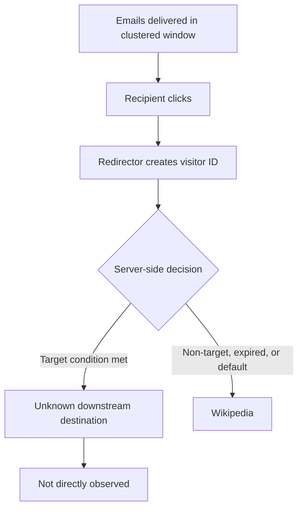

# Threat Assessment

## Assessment statement

> **High-confidence phishing-related infrastructure with dynamic redirection, visitor
> tracking, and probable cloaking.**

> The investigation did not directly observe a credential-harvesting or recovery-phrase
> form. The assessment is based on the combined email impersonation, lookalike domain,
> Alchemer delivery artifacts, dynamic visitor registration, cloaking-related client
> logic, and server-selected redirect behavior.

## Claims deliberately **not** made

- "confirmed credential theft"
- "confirmed wallet-draining site"
- "confirmed attacker panel"
- "confirmed anti-analysis / anti-Kali detection"
- "confirmed compromised Alchemer account"
- "attacker's Cloudflare server"

---

## Campaign-lifecycle hypotheses

The author proposed that the operator may have kept the phishing destination active
shortly after sending the emails, collected information from early clickers, and later
disabled it. The evidence supports only **part** of that idea.

### Supported

- **FACT:** The emails were clustered within 58 minutes.
- **FACT:** The following morning, the infrastructure still operated.
- **FACT:** The observed final destination was Wikipedia rather than a visible
  Ledger-themed form.

### Plausible but unproven

| Hypothesis | Description | Confidence |
|---|---|---|
| **A — Destination changed after delivery** | Operator changed the active destination to Wikipedia after the initial window. | Moderate |
| **B — Default safe redirect** | Wikipedia configured as a benign default when no active target exists. | Low–Moderate |
| **C — Selective cloaking** | This visitor classified as non-target/suspicious and sent to a benign page. Possible criteria: network reputation, geography, user agent, cookie state, route value, timing, browser behavior. | Moderate that selective logic existed; criteria unknown |
| **D — Campaign expired** | Route valid but no longer associated with its original destination. | Moderate |
| **E — Destination was always Wikipedia** | Technically possible but inconsistent with surrounding phishing indicators and dynamic visitor logic. | Low |

The unknown downstream destination was **not** observed.

### Required conclusion

> The evidence shows that the redirector remained active while the observed destination
> had become or was selected as Wikipedia. The available evidence does not establish
> whether a different destination was served to earlier recipients.

!!! warning "Do not write"
    > The attacker definitely removed the phishing page after harvesting credentials.

---

## MITRE ATT&CK mapping (behavioral approximation only)

Potentially relevant high-level mappings:

| Technique | ID | Basis |
|---|---|---|
| Phishing | T1566 | Impersonation email delivered to the recipient |
| Phishing: Spearphishing Link | T1566.002 | Message contained a link to attacker-controlled infrastructure |
| User Execution: Malicious Link | T1204.001 | Redirect flow depends on the user clicking the link |
| Web Service | T1102 | Use of Cloudflare-fronted web infrastructure |

> ATT&CK mappings are behavioral approximations and do not prove actor identity or
> campaign attribution.

Credential-theft or exfiltration techniques are **not** mapped, because no such activity
was directly observed.
