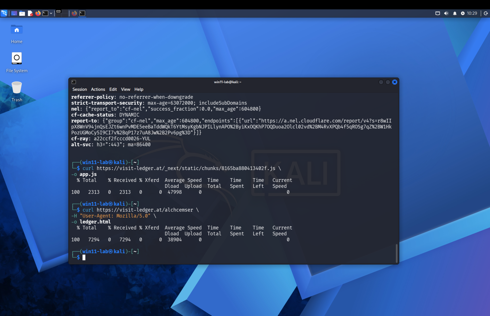

# Web Analysis

Analysis of the initial HTML shell and the Next.js dynamic route. The JavaScript logic is
covered separately in [JavaScript Analysis](javascript-analysis.md).

---

## 1. Initial HTML acquisition

```bash
curl https://visit-ledger.at/alchcemser \
  -H "User-Agent: Mozilla/5.0" \
  -o ledger.html
```

Observed file size: **7294 bytes**. Saved as `/home/win11-lab/ledger.html`.

<a id="figure-g"></a>


> **Figure G — HTML page download.** The `curl` transfer meter confirms
> `ledger.html` = **7294 bytes** (with `User-Agent: Mozilla/5.0`). In the captured
> sequence this HTML save occurred at 10:29:12, **after** the `app.js`
> download at 10:28:36 — see [Timeline](timeline.md). The chunk filename would have been
> known from an earlier view of the page/shell.

Content searches returned no matches:

```bash
grep -i "<form" ledger.html
grep -i "action=" ledger.html
grep -i "seed" ledger.html
grep -i "phrase" ledger.html
grep -i "wallet" ledger.html
grep -i "recover" ledger.html
grep -i "mnemonic" ledger.html
```

**FACT:** The initial HTML did not contain those searched terms.

!!! warning "Do not over-conclude"
    This does **not** establish that the application never contained a phishing form. The
    initial HTML was only the current server response and the JavaScript shell. The real
    behavior is produced client-side after JavaScript execution.

---

## 2. Initial HTML structure

The downloaded HTML included:

```html
<title>Redirect</title>
<meta name="description" content="redirect"/>
```

It loaded assets from:

```text
/_next/static/chunks/
```

The visible body contained a loading spinner:

```html
<div class="w-10 h-10 border-2 border-zinc-500 border-t-zinc-200 rounded-full animate-spin ..."></div>
```

The embedded Next.js data included a **not-found component** with text:

```text
Page not found
The page you're looking for doesn't exist or has been moved.
```

and links to `/` and `/panel` with visible labels `Go home` and `Panel`.

### Interpretation of the panel reference

**FACT:** The application bundle contained a `/panel` link in the not-found component.

!!! danger "Not accessed"
    Access to `/panel` was **not** attempted and is not instructed here. The panel is
    **not** asserted to be an attacker administration panel.
    > The application's client bundle referenced a route labeled "Panel." Its purpose and
    > access controls were not tested.

---

## 3. Next.js dynamic route

Embedded Next.js data included:

```text
"c":["","alchcemser"]
```

and:

```text
params":{"email":["alchcemser"]}
```

**FACT:** The route value `alchcemser` was passed to the page component through a
parameter named `email`.

**UNKNOWN:** The parameter name does not prove that the route value was an actual email
address.

Possible interpretations (treated only as possibilities): route slug, campaign token,
recipient key, identifier, or alias.

---

## 4. Referenced JavaScript chunk

The page referenced:

```text
/_next/static/chunks/8165ba880413402f.js
```

This chunk was retrieved and analyzed; see [JavaScript Analysis](javascript-analysis.md).
